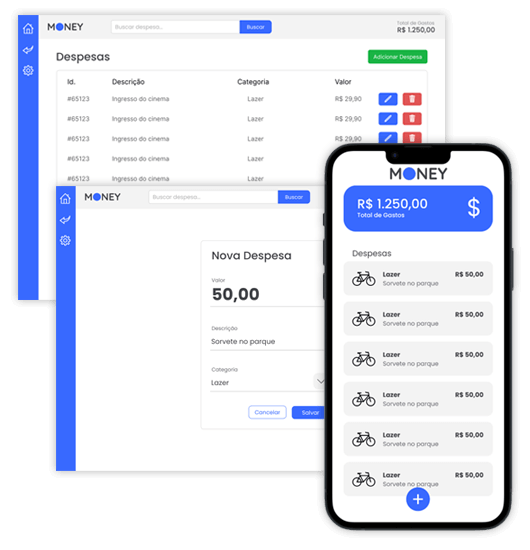

<p align="center">
  
</p>

# Projeto Money Mobile - Aulas DevPoint

### ✔️Sobre

Bem-vindo ao projeto Money - Controle de Despesas! Desenvolvido para ajudar os usuários a gerenciar suas finanças pessoais de forma eficiente e descomplicada. Com este aplicativo, você pode registrar, consultar, excluir e manter suas despesas financeiras organizadas e acessíveis.

Este projeto foi iniciado com o comando:
```
npx create-expo-app --template
```

### 🚀Tecnologias Utilizadas - Breve Descrição

- **React Native:** Biblioteca JavaScript para construir interfaces de usuário nativas.
- **Expo:** Plataforma para desenvolvimento de aplicativos React Native.
- **Picker:** Componente para seleção de opções.
- **react Navigation:** Biblioteca para navegação e roteamento em aplicativos React Native.
- **Axios:** Biblioteca para fazer requisições HTTP.

#### 📌Instruções:

- **Instalar as dependências:** 
```
npm install
```
- **Executar o projeto:** 
```
npx expo start
```

## 📱 Captura de Tela do App

<p align="center">
  
</p>

